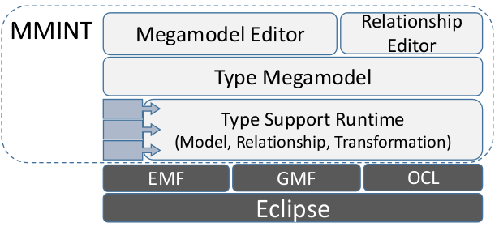

# MMINT 

**Model Management INTeractive (MMINT)** is an Eclipse-based workbench for graphical, interactive model management. MMINT allows modelers to do rapid prototyping and exploratory modeling while seamlessly keeping track of all relevant artifacts in their workspace. MMINT is developed by the Software Engineering group at the [University of Toronto](https://web.cs.toronto.edu), under the supervision of Professor [Marsha Chechik](http://www.cs.toronto.edu/~chechik).

**Model Management** is the management of collections of related models. It provides tools and techniques for dealing with large sets of models, defining relationships among models, manipulating models and relationships using operators (i.e., transformations). A special kind of model, generally called a **megamodel**, is used to represent such a scenario, with models as nodes and their relationships as arrows. Models and relationships are typically considered to be typed by their respective metamodels.

  

MMINT provides a graphical form of megamodel called a **Model Interconnection Diagram (MID)** as the interface through which to perform actions. In addition to the standard megamodel interactions already supported by existing interactive model management techniques, MMINT provides support for an additional layer, the **Type megamodel**, representing the collection of metamodels, relationships and transformations between them. The Type megamodel can be examined, modified and extended at runtime, allowing the user to have a dynamic type system and a reconfigurable workbench.

MMINT is used by the Software Engineering group as a common research platform and prototyping workbench, and it is rapidly evolving. Please be aware that the project's goal is not to become a production-level software, but to try and make our efforts available to the research community. As such, you will most certainly run into bugs.

# Install

The easiest way of installing MMINT is using the binary packages. Alternatively, you can download and build the sources. Please take a look at the software requirements first to check that your system can run MMINT (binary packages will automatically take care of all Eclipse dependencies).

### Software Requirements

Requirements marked with _(Required for ...)_ are optional except for the specified component.

* Java >= 14
* Eclipse Modeling Tools 2020-09. Once installed, use `Help > Install New Software` to add the following components:
  * Acceleo
  * Papyrus for UML
  * Sirius Properties Views - Specifier Support
  * Sirius Specifier Environment
  * Sirius Integration with Xtext
  * VIATRA Query and Transformation SDK
  * ATL SDK - ATL Transformation Language SDK _(Required for Modelepedia ClassDiagram)_
  * Henshin SDK _(Required for MU-MMINT and Z3, add the software site http://download.eclipse.org/modeling/emft/henshin/updates/release)_

### Binary packages

Binary packages for MMINT are automatically created at each release. First add `https://adisandro.github.io/mmint/release` to the list of software sites in Eclipse (`Help > Install New Software > Available Software Sites`). Then, look under the `Modeling` category and install `MMINT`.

You can also install `MMINT-A` (a version of MMINT that supports automotive assurance cases), and<!-- `MU-MMINT` (a version of MMINT that supports design uncertainty using the MAVO framework), and--> a selection of pre-packaged model types, relationship types and operators under the `Modelepedia` category. Remember to add the additional software sites that are required for the components you are installing, as highlighted in the software requirements section above, and Eclipse will take care of the dependencies.

Binary packages for the current development version of MMINT are similarly available using the software site `https://adisandro.github.io/mmint/develop`.

### Sources

Building the sources requires using Git as version control system (http://git-scm.com/). To import the sources in your Eclipse workspace, use `File > Import` and then `Projects from Git` under the `Git` category. Then, right-click on any project and `Run As > Eclipse Application`.

The projects are under the [plugins](https://github.com/adisandro/MMINT/tree/master/plugins) directory: required projects under [Core](https://github.com/adisandro/MMINT/tree/master/plugins/Core), projects that significantly extend functionality under [Core-Extensions](https://github.com/adisandro/MMINT/tree/master/plugins/Core-Extensions), optional and domain specific projects under [Types](https://github.com/adisandro/MMINT/tree/master/plugins/Types) and projects that deal with external tools under [External](https://github.com/adisandro/MMINT/tree/master/plugins/External). The [features](https://github.com/adisandro/MMINT/tree/master/features) directory contains the logical units of functionality, [tests](https://github.com/adisandro/MMINT/tree/master/tests) contains a suite for regression testing, [releng](https://github.com/adisandro/MMINT/tree/master/releng) contains the release engineering code, and [examples](https://github.com/adisandro/MMINT/tree/master/examples) contains artifacts created with MMINT for various papers.

Maven and Tycho are used for build automation tasks, you should install the additional `m2e - Maven Integration for Eclipse` component.

# Publications

### About MMINT

* MMINT-A 2.0: Tool Support for the Lifecycle of Model-Based Safety Artifacts [MoDELS 20]
* [MMINT-A: A Tool for Automated Change Impact Assessment on Assurance Cases](https://doi.org/10.1007/978-3-319-99229-7_7) [SAFECOMP 18]
* [MU-MMINT: An IDE for Model Uncertainty](https://doi.org/10.1109/ICSE.2015.226) [ICSE 15]
* [MMINT: A Graphical Tool for Interactive Model Management](http://ceur-ws.org/Vol-1554/PD_MoDELS_2015_paper_6.pdf) [MoDELS 15]

### Using MMINT

* Assurance case property checking with MMINT-A and OCL [CSER 20]
* [Heterogeneous Megamodel Management using Collection Operators](https://doi.org/10.1007/s10270-019-00738-9) [SoSyM Vol. 19-1] ([[see here for experiments|Publications: SoSyM19]])
* [Querying Automotive System Models and Safety Artifacts with MMINT and Viatra](https://doi.org/10.1109/MODELS-C.2019.00008) [MASE@MoDELS 19]
* [Migrating Automotive Product Lines: A Case Study](https://doi.org/10.1007/978-3-319-21155-8_7) [ICMT 15]
* [Enriching megamodel management with collection-based operators](https://doi.org/10.1109/MODELS.2015.7338254) [MoDELS 15]
* [Lifting model transformations to product lines](https://doi.org/10.1145/2568225.2568267) [ICSE 14]
* [Supporting early decision-making in the presence of uncertainty](https://doi.org/10.1109/RE.2014.6912245) [RE 14]
* [Managing requirements uncertainty with partial models](https://doi.org/10.1007/s00766-013-0170-y) [REJ Vol. 18-2]
* [Transformation of Models Containing Uncertainty](https://doi.org/10.1007/978-3-642-41533-3_41) [MoDELS 13]
